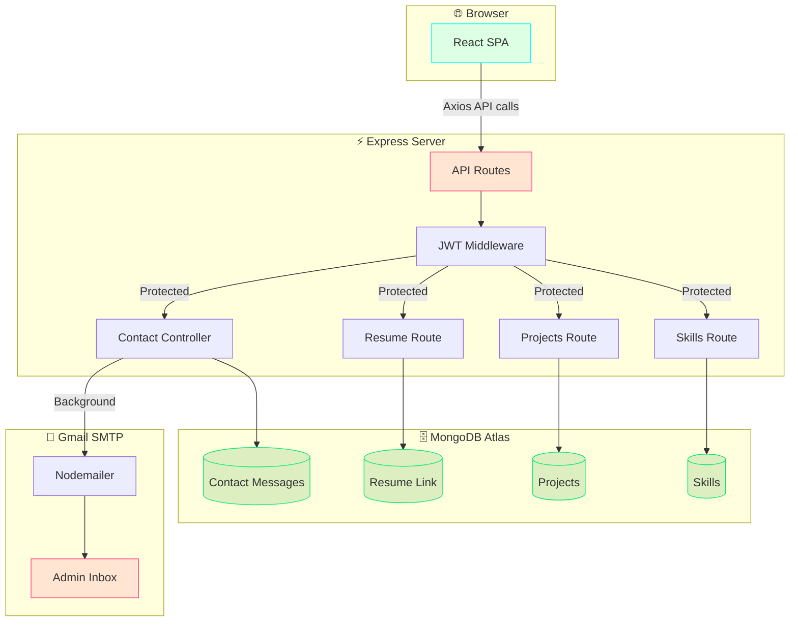

<div align="center">

<!-- Animated Banner -->


<!-- Typing Animation -->
<a href="https://git.io/typing-svg">
  
</a>

<br/><br/>

<!-- Profile Views + Stars + Forks -->

&nbsp;

&nbsp;

&nbsp;


<br/><br/>

<!-- Live Demo Button -->
<a href="https://hp-portfolio-ujjo.onrender.com" target="_blank">
  
</a>
&nbsp;
<a href="mailto:patilharshal2282@gmail.com">
  
</a>

</div>

---

<div align="center">

## ⚡ What Is This?

</div>

> **DevHarsh** is a **full-stack personal portfolio** built from scratch with a dark-neon aesthetic, real-time admin dashboard, automated email notifications, and a MongoDB-powered content management system — all wrapped in a production-ready MERN stack architecture.

No templates. No themes. Every pixel crafted intentionally. 🎨

---

<div align="center">

## 🌟 Feature Showcase

</div>

<table>
<tr>
<td width="50%">

### 🏠 Home & Hero
- ⌨️ Animated typewriter effect (`AI Full Stack Developer`, `ML Enthusiast`, `Creative Coder`)
- 🔗 Dynamic **Download Resume** button — fetches live Google Drive link from DB
- 🌊 Smooth scroll + section-based layout

</td>
<td width="50%">

### 👤 About Me
- 🖼️ Floating profile image with neon glow animation
- 🏷️ Animated skill tags with hover effects
- 📄 Smart resume button — active link or graceful "Coming Soon"

</td>
</tr>
<tr>
<td width="50%">

### 🛠️ Skills & Timeline
- 🟦 MongoDB-powered skills grid (editable from admin)
- 🌀 Framer Motion scroll-reveal animations
- 🎓 Education timeline from Primary → B.Tech (NMIMS)

</td>
<td width="50%">

### 🚀 Projects Gallery
- 📦 Database-driven project cards
- 🔥 Hover scale animations
- 🔗 GitHub + Live Demo links per project

</td>
</tr>
<tr>
<td width="50%">

### 📩 Contact Form
- ✅ Saves to MongoDB on submission
- 📧 **Auto-emails admin** on every new message
- ⏳ Loading state + success/error feedback

</td>
<td width="50%">

### ⚙️ Admin Dashboard
- 🔐 JWT-protected login
- 🔗 Google Drive resume link manager
- 📋 Full CRUD — Projects, Skills, Messages

</td>
</tr>
</table>

---

<div align="center">

## 🛠️ Tech Stack

</div>

### Frontend


### Backend


### DevOps & Tools


---

<div align="center">

## 🏗️ Architecture

</div>



---

<div align="center">

## 📁 Project Structure

</div>

```
📦 portfolio/
├── 📂 Server/                          # Express.js Backend
│   ├── 📂 config/
│   │   └── 📄 emailService.js          # Nodemailer Gmail transport
│   ├── 📂 Controllers/
│   │   └── 📄 contactController.js     # Save message + email admin
│   ├── 📂 middleware/
│   │   └── 📄 verifyToken.js           # JWT auth guard
│   ├── 📂 models/
│   │   ├── 📄 Contact.js               # Contact message schema
│   │   ├── 📄 Project.js               # Project schema
│   │   ├── 📄 Resume.js                # Drive link schema
│   │   └── 📄 Skill.js                 # Skill schema
│   ├── 📂 routes/
│   │   ├── 📄 auth.js                  # Login + JWT sign
│   │   ├── 📄 contactRoutes.js         # POST /submit, GET /
│   │   ├── 📄 projects.js              # Full CRUD
│   │   ├── 📄 resume.js                # GET/PUT drive link
│   │   └── 📄 skills.js                # Full CRUD
│   ├── 📄 .env                         # 🔒 NOT committed
│   ├── 📄 .gitignore
│   ├── 📄 package.json
│   └── 📄 server.js                    # App entry point
│
└── 📂 client/                          # React Frontend
    └── 📂 src/
        ├── 📂 assets/                  # Images, logo
        ├── 📂 components/
        │   ├── 📄 Navbar.js / .css
        │   └── 📄 ProtectedRoute.js
        └── 📂 pages/
            ├── 📄 Hero.js              # Typewriter + dynamic resume btn
            ├── 📄 About.js             # Profile + dynamic resume btn
            ├── 📄 Skills.js            # MongoDB-powered skills
            ├── 📄 Timeline.js          # Education journey
            ├── 📄 Projects.js          # DB-driven project cards
            ├── 📄 Contact.js           # Form + email notification
            ├── 📄 Admin.js             # Protected dashboard
            └── 📄 Login.js             # JWT login
```

---

<div align="center">

## 🚀 Getting Started

</div>

### Prerequisites

```bash
node >= 18.x
npm >= 9.x
MongoDB Atlas account
Gmail account with App Password enabled
```

### 1️⃣ Clone the Repository

```bash
git clone https://github.com/Harshalpatil2282/Portfolio.git
cd Portfolio
```

### 2️⃣ Setup the Backend

```bash
cd Server
npm install
```

Create your `.env` file inside `Server/`:

```env
PORT=5000
MONGO_URI=your_mongodb_atlas_connection_string

JWT_SECRET=your_super_secret_key
ADMIN_USERNAME=your_admin_username
ADMIN_PASSWORD=your_admin_password

EMAIL_USER=your_gmail@gmail.com
EMAIL_PASSWORD=your_gmail_app_password_16chars
ADMIN_EMAIL=your_personal@gmail.com
```

> 💡 **Gmail App Password**: Google Account → Security → 2-Step Verification → App Passwords

Start the backend:
```bash
npm run dev         # Development (nodemon)
npm start           # Production (node)
```

### 3️⃣ Setup the Frontend

```bash
cd ../client
npm install
npm start           # Starts on http://localhost:3000
```

### 4️⃣ Access Admin Dashboard

```
URL:      http://localhost:3000/login
Username: (as set in .env → ADMIN_USERNAME)
Password: (as set in .env → ADMIN_PASSWORD)
```

---

<div align="center">

## 🔌 API Reference

</div>

<details>
<summary><b>📩 Contact</b></summary>

| Method | Endpoint | Auth | Description |
|--------|----------|------|-------------|
| `POST` | `/api/contact/submit` | ❌ Public | Submit contact form → saves to DB + emails admin |
| `GET` | `/api/contact` | ✅ Admin | Fetch all contact messages |

</details>

<details>
<summary><b>📄 Resume</b></summary>

| Method | Endpoint | Auth | Description |
|--------|----------|------|-------------|
| `GET` | `/api/resume/link` | ❌ Public | Get the active Google Drive resume link |
| `PUT` | `/api/resume/link` | ✅ Admin | Update the resume Drive link |

</details>

<details>
<summary><b>🚀 Projects</b></summary>

| Method | Endpoint | Auth | Description |
|--------|----------|------|-------------|
| `GET` | `/api/projects` | ❌ Public | Fetch all projects |
| `POST` | `/api/projects/add` | ✅ Admin | Add a new project |
| `PUT` | `/api/projects/edit/:id` | ✅ Admin | Edit a project |
| `DELETE` | `/api/projects/delete/:id` | ✅ Admin | Delete a project |

</details>

<details>
<summary><b>🛠️ Skills</b></summary>

| Method | Endpoint | Auth | Description |
|--------|----------|------|-------------|
| `GET` | `/api/skills` | ❌ Public | Fetch all skills |
| `POST` | `/api/skills/add` | ✅ Admin | Add a new skill |
| `DELETE` | `/api/skills/delete/:id` | ✅ Admin | Delete a skill |

</details>

<details>
<summary><b>🔐 Auth</b></summary>

| Method | Endpoint | Auth | Description |
|--------|----------|------|-------------|
| `POST` | `/api/auth/login` | ❌ Public | Admin login → returns JWT (expires in 1h) |

</details>

---

<div align="center">

## ☁️ Deploy to Render

</div>

**1. Push to GitHub**
```bash
git add .
git commit -m "feat: ready for deployment"
git push origin main
```

**2. Create a Web Service on [Render](https://render.com)**

| Setting | Value |
|---------|-------|
| Root Directory | `Server` |
| Build Command | `npm run build` |
| Start Command | `node server.js` |
| Environment | `Node` |

**3. Add all `.env` variables** in Render's Environment tab

**4. Done! 🎉** Render auto-builds React and serves it from Express.

---

<div align="center">

## 👨‍💻 About The Developer

</div>

<div align="center">
  
  <br/><br/>
  
  <br/><br/>
  
</div>

<br/>

<div align="center">

| 🎓 Education | 🏛️ Institution | 📅 Year |
|:---:|:---:|:---:|
| B.Tech — Computer Engineering | SVKM's NMIMS, Shirpur | 2023 – 2027 |
| Higher Secondary (Science) | S.S.V.P.S. College, SNK | 2021 – 2023 |
| Secondary School — 93.80% | Vivekanand Vidhyalaya, Khalane | 2016 – 2021 |

</div>

---

<div align="center">

## 🤝 Connect With Me

[](https://www.linkedin.com/in/harshal-patil-a28a96292/)
[](https://github.com/Harshalpatil2282)
[](mailto:patilharshal2282@gmail.com)
[](https://hp-portfolio-ujjo.onrender.com)

</div>

---

<div align="center">

## 📜 License

This project is licensed under the **MIT License** — feel free to fork, star ⭐, and build on it!

<br/>


</div>
